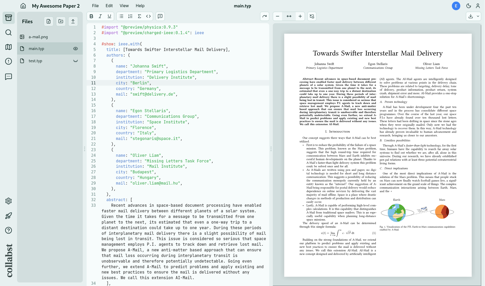
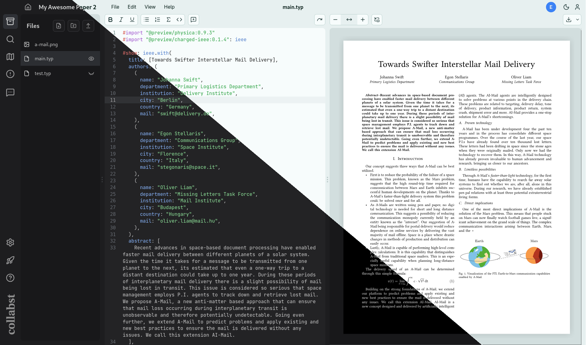
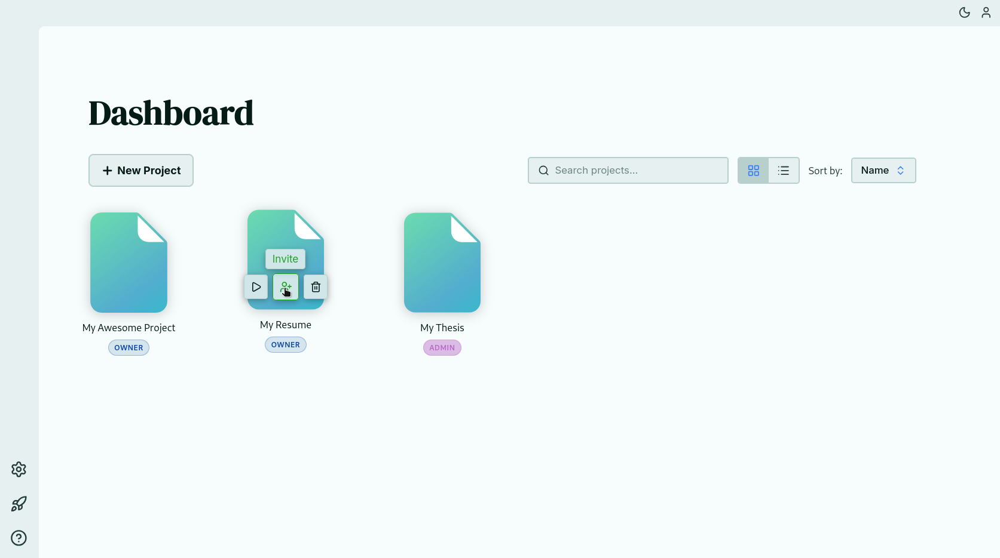
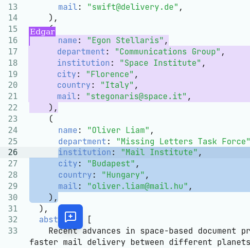
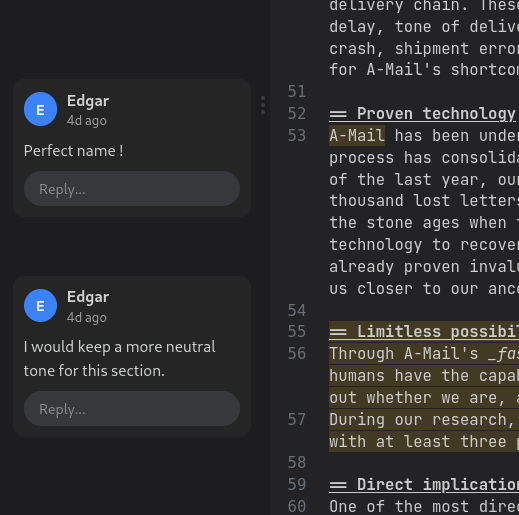
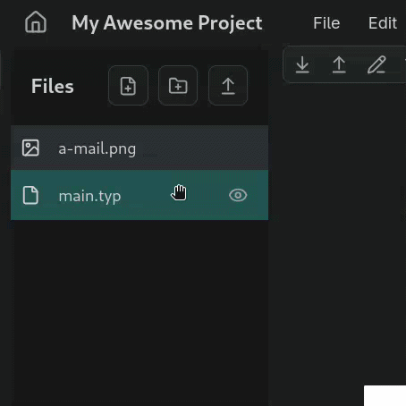
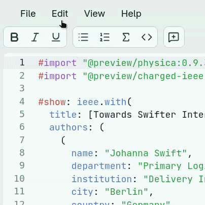
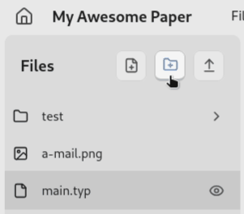
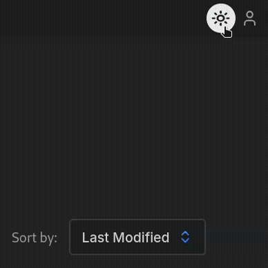

<h1 align="center">
  
  <br />
  <h4 align="center">
    (pronounced collapsed, /kəˈlæpst/)
    <br />
    <b>Self-host a collaborative workspace for Typst.</b>
  </h4>
</h1>

> [!CAUTION]
> **This repo is under maintainance and is not currently functional. Don't worry, once the refactor and redesign is complete, Collabst will be back!**

<!--
<p align="center">

</p>
-->

<p align="center">
  
  &nbsp;
  
</p>

<br />

> **Authors Note:** \
> *Collabst is aimed at personal collaborative projects and research labs. It is not affiliated in any way with the Typst brand. \
> We are aware of the delicate balance of the business model behind Typst development. As such, this project **does not aim to compete with [Typst's official web app](https://typst.app/)**. \
> Furthermore, as stated in the [license](LICENSE), we do not provide any guarantees regarding the use of Collabst: If your organization needs to set up a reliable service with professional technical support, we recommend contacting the Typst team directly in order to get a proper paid plan for self-hosting the official web app.*

> *The Collabst project's goal is to help and accelerate Typst adoption, especially in research labs and scientific production. We believe we can contribute to creating the conditions for scientific knowledge to be entirely produced using sovereign tools, with open source software and easy collaboration in mind.*

<br />

> [!CAUTION]
> We recommend using Collabst only in environments where **all** users are trusted.

<br />

<!--
## 💥 Features

Collabst allows you to collaborate on Typst projects and preview them while editing in your browser. Here are its main features: 
<h3 align="center">Elegant Light and Dark Theme</h3>
<div align="center">
  
</div>

<h3 align="center">Dashboard for managing your Projects</h3>
<div align="center">
  
</div>

<h3 align="center">Collaborative Editing &amp; Comments</h3>
<div align="center">
  <table align="center">
    <tr>
      <td style="padding:0;">
        
      </td>
      <td style="padding:0;">
        
      </td>
    </tr>
  </table>
</div>

<h3 align="center">Sweet &amp; snappy animations</h3>
<div align="center">
  <table cellspacing="0" cellpadding="0" style="border-spacing:0; border-collapse:collapse;">
    <tr>
      <td style="padding:0;"></td>
      <td style="padding:0;"></td>
    </tr>
    <tr>
      <td style="padding:0;"></td>
      <td style="padding:0;"></td>
    </tr>
  </table>
</div>

And much more!

## 🏗️ How to Install

### Quick Setup🏃‍♀️‍➡️

Make sure you have **Docker** and **Docker Compose** installed, then run:

```bash
# 1. Download the compose file and env template
curl -o docker-compose.yml https://raw.githubusercontent.com/collabst/collabst/main/docker-compose.yml
curl -o .env https://raw.githubusercontent.com/collabst/collabst/main/.env.example

# 2. Fill in your values (URLs, passwords, secret key)
nano .env

# 3. Start
docker compose up -d
```

Your instance will be available at the `WEB_URL` you configured.

> **Tip:** Generate a secure secret key with `openssl rand -hex 32`.

### Nightly builds 🌙

> [!WARNING]
> Nightly builds are built from the latest commit on `main` and may be unstable or broken. Use them at your own risk.

If you want to try the latest features before a stable release, you can run the nightly image by setting `COLLABST_TAG=nightly` in your `.env` file, or by passing it inline:

```bash
COLLABST_TAG=nightly docker compose up -d
```

### Detailed Setup📜
For the complete setup instructions, you can follow the [`SETUP.md`](/SETUP.md) file.

## 👋 Contributing
We are looking for contributions to the Collabst project! There are many features that can still be added or refined, and certainly some bugs that could be fixed.

If you want to contribute, please check the [`CONTRIBUTING.md` Guidelines](/CONTRIBUTING.md).
-->

## 🙏 Acknowledgements

*This project could not exist without:*
- The open source **[Typst Compiler](https://typst.app/open-source/)**
- [Myriad-Dreamin](https://github.com/Myriad-Dreamin)'s integrated language service **[Tinymist](https://github.com/Myriad-Dreamin/tinymist)** and JavaScript implementation **[typst.ts](https://github.com/Myriad-Dreamin/typst.ts)**
- **[Codemirror](https://codemirror.net/)**
- [Levi Zim](https://github.com/kxxt)'s Code Mirror extension for Typst support **[codemirror-lang-typst](https://github.com/kxxt/codemirror-lang-typst)**
- **[Lucide](https://lucide.dev/)**'s very clean icons.

For a more in-depth description of the tech used in Collabst, you can [**click here**](/doc/TECH.md).

## 🧑‍🔧 Credits

Contributors

<a href="https://github.com/collabst/collabst/graphs/contributors">
  
</a>

<br />

*Collabst was created by*

<table>
  <tr>
    <td align="center" valign="top">
      <a href="https://github.com/gdamms">
        
      </a><br/>
      <strong>Damien Guillotin</strong><br/>
      Optimizations, Front &amp; Backend
    </td>
    <td align="center" valign="top">
      <a href="https://github.com/edgaremy">
        
      </a><br/>
      <strong>Edgar Remy</strong><br/>
      UX Design, Visuals &amp; Frontend
    </td>
    <td align="center" valign="top">
      <a href="https://github.com/maxime-vaillant">
        
      </a><br/>
      <strong>Maxime Vaillant</strong><br/>
      CI/CD Setup
    </td>
    <td align="center" valign="top">
      <a href="https://github.com/travisseng">
        
      </a><br/>
      <strong>Travis Seng</strong><br/>
      Optimizations, Front &amp; Backend
    </td>
  </tr>
</table>

<br />
<br />

<div align="center">
  <a href="https://ko-fi.com/collabst">
    
  </a>
</div>

