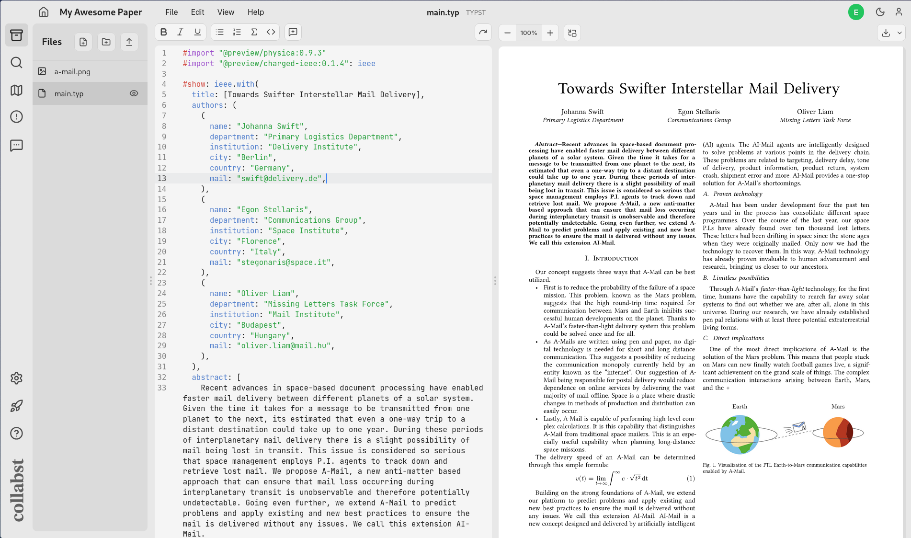

  
  <em>(pronounced collapsed, /kəˈlæpst/)</em>

Self-host a collaborative workspace for Typst.

 

 

> **Authors Note:** \
> *Collabst is currently aimed at personal collaborative projects and scientific lab projects, and is not affiliated in any way with the Typst brand. \
> We are aware of the delicate balance of the business model behind the Typst development. As such, this project **does not aim to compete with the official [Typst's official web app](https://typst.app/)**. \
> Furthermore, as stated in the [license](LICENSE), we do not provide any support or garantees regarding the use of Collabst: If your organization needs to set up a reliable service with technical support, we cannot recommand enough to contact the Typst team directly, in order to get a proper paid plan for self-hosting the official web app.*

> *In the long run, the Collabst project's goal is to contribute in creating the conditions for scientific knowledge to be entirely produced using sovereign tools, with open source software and easy collaboration in mind.*

&nbsp;

## 💥 Features
***TODO***

## 🏗️ How to Install

### Quick Setup🏃‍♀️‍➡️
If you already have docker-compose and npm installed, you can simply clone this repo and launch the make file:

***TODO***

### Detailed Setup📜
For the complete setup instructions, you can follow the [`SETUP.MD`](/SETUP.md) file.

## 🙏 Acknowledgements

*This project could not exist without:*
- The open source **[Typst Compiler](https://typst.app/open-source/)**
- [Myriad-Dreamin](https://github.com/Myriad-Dreamin)'s integrated language service **[Tinymist](https://github.com/Myriad-Dreamin/tinymist)** and Javascript Implementation **[typst.ts](https://github.com/Myriad-Dreamin/typst.ts)**
- **[Codemirror](https://codemirror.net/)**
- [Levi Zim](https://github.com/kxxt)'s code mirror extension for typst support **[codemirror-lang-typst](https://github.com/kxxt/codemirror-lang-typst)**
- **[Lucide](https://lucide.dev/)**'s very clean icons.

## 🧑‍🔧 Credits

*Collabst was created by*

<table>
  <tr>
    <td align="center" valign="top">
       
      <strong>Damien Guillotin</strong> 
      Front & Backend
    </td>
    <td align="center" valign="top">
       
      <strong>Edgar Remy</strong> 
      UX Design, Visuals &amp; Frontend
    </td>
    <td align="center" valign="top">
       
      <strong>Maxime Vaillant</strong> 
      CI/CD Setup
    </td>
    <td align="center" valign="top">
       
      <strong>Travis Seng</strong> 
      Optimizations, Front &amp; Backend
    </td>
  </tr>
</table>
