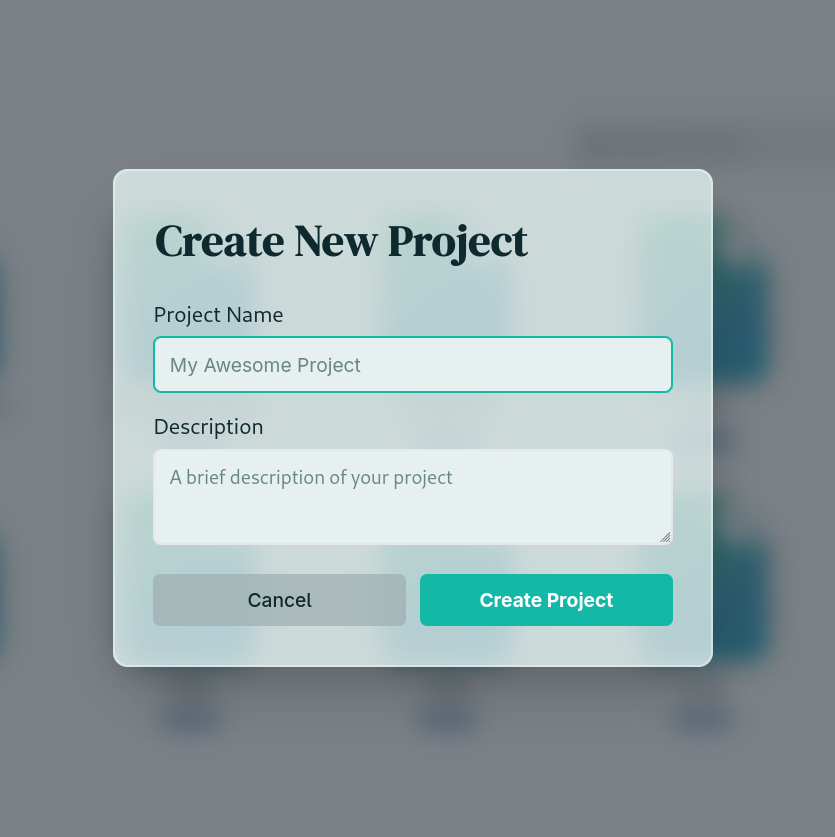
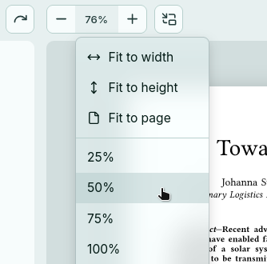
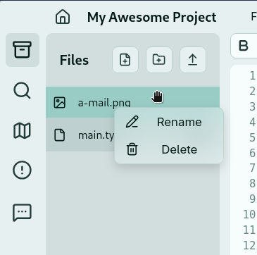
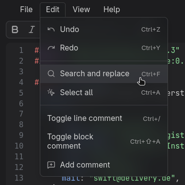
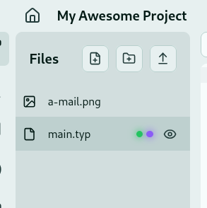
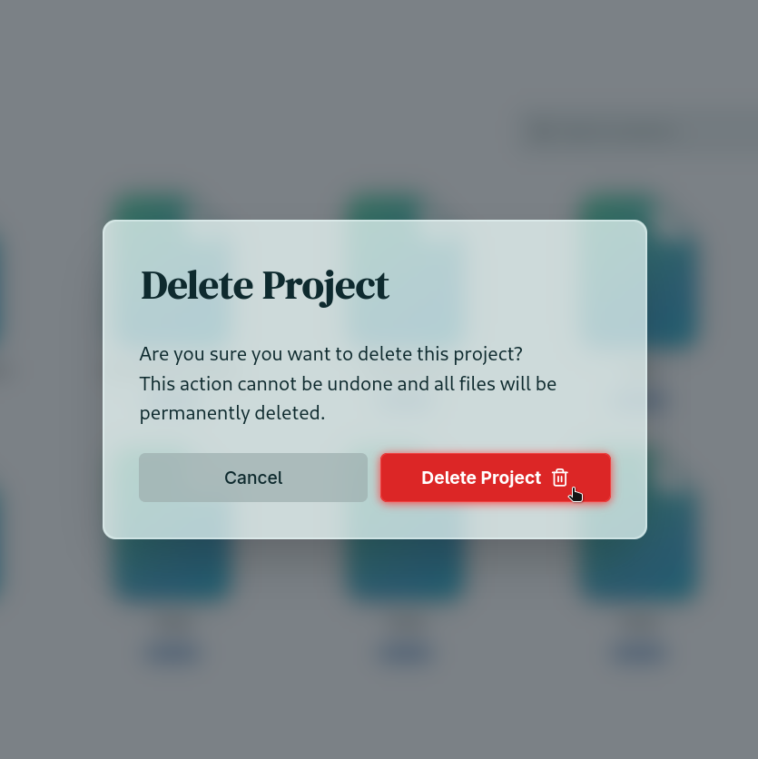
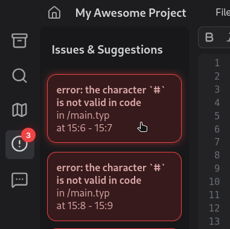
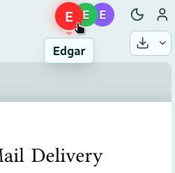
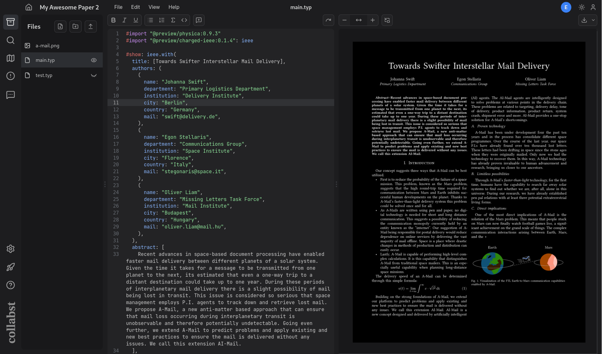

# Designing Collabst

This document outlines some of the design choices and philosophy behind Collabst's UI.

## Inspirations

The User Interface was inspired by several existing Text Editors. Obviously, the main inspiration is the **official Typst Web App**, which is great, with a friendly & very intuitive UI. As we are trying to make an open source equivalent for it, there is no point in diverging too much from what the Typst community is used to.

Inspiration was also drawn from other popular interfaces, such as **VSCode**, with its modern icons and borderless UI, and **Google Docs**, with its off-white color palette.

We still wanted to make Collabst have its own identity, and so explored ways to make it look unique.

## Visual Identity

### Blur and Light-glow

Collabst has some blurred UI elements sprinkled throughout, notably for dropdown menus, right-click menus and dialogs. This helps to add depth to the otherwise mostly flat interface, while also contributing to the modern aesthetic we're aiming for.

  <table cellspacing="0" cellpadding="0" style="border-spacing:0; border-collapse:collapse;">
    <tr>
      <td style="padding:0;"></td>
      <td style="padding:0;"></td>
    </tr>
    <tr>
      <td style="padding:0;"></td>
      <td style="padding:0;"></td>
    </tr>
  </table>

<h4 align="center">Use of blur in menus</h4>

The blurred backgrounds also fit pretty well with a different use of blur: adding a "glow" effect to the few colored elements of the UI. This tries to mimic a light bulb or neon glow, attracting the eye to important elements or lighting up when interacting with them.

  <table cellspacing="0" cellpadding="0" style="border-spacing:0; border-collapse:collapse;">
    <tr>
      <td style="padding:0;"></td>
      <td style="padding:0;"></td>
    </tr>
    <tr>
      <td style="padding:0;"></td>
      <td style="padding:0;"></td>
    </tr>
  </table>

<h4 align="center">Glow effect for colored elements</h4>

### Snappy yet Lively Animations

Animations were added throughout the Editor & Dashboard buttons, to make everything feel more responsive. They aim to be snappy but feel fun and quirky.

  <table cellspacing="0" cellpadding="0" style="border-spacing:0; border-collapse:collapse;">
    <tr>
      <td style="padding:0;"></td>
      <td style="padding:0;"></td>
    </tr>
    <tr>
      <td style="padding:0;"></td>
      <td style="padding:0;"></td>
    </tr>
  </table>

<h4 align="center">Some of Collabst's animations</h4>

In order to make the animations feel responsive, we use the same approach as **video game animation**: the first motion caused by user interaction has to use very few frames (in our case use a very short time or even be instantaneous) in order to convey responsiveness and avoid a feeling of input lag.

In order to make the animations fun and satisfying, many components hover or jump in a bouncy way. The trick is to treat object deformation through movement like **traditional drawn animation**: 1. Anticipation 2. Movement 3. Consequence. For instance, when a component plays a vertical jump animation 1. It compresses itself, gets shorter and larger 2. It jumps and gets longer and thinner 3. It stops its jump and gets shorter and larger from the inertia of its movement. This requires a lot of tinkering to get right, but well-crafted animations really make the application more pleasant to use.

### Icons & Fonts

Most components in Collabst have either just an icon, or text AND an associated icon. Icons can really help convey information faster than reading text can, they can also help the user find an already known feature faster. We use [Lucide](https://lucide.dev/)'s icons, which provide a wide array of shapes, with a modern and unified outline style.

Most of the components use a functional sans serif font, but for some needed variation, some of the bigger texts and titles use [DM Serif Display](https://fonts.google.com/specimen/DM+Serif+Display) made by the Colophon Foundry.

## Light & Dark Theme

We really wanted to have a dark theme that did not feel like an afterthought, especially as Collabst is the kind of tool that can be used during the day or late at night.

The philosophy for the theme design (light and dark) was to have the lighter shades draw attention to the most important elements: the Preview, the Code panel and the tool buttons. For the color palette choice, we wanted to avoid harsh shades like pure black or pure white in most cases (the document preview obviously still has its white paper background for instance).

In particular, pure white backgrounds can make the UI quite aggressive to read on, so we opted for off-white shades, with a slight turquoise tint for the light theme, to make the application more welcoming. For the dark theme, pure black backgrounds were also avoided, preferring shades of dark greys instead. The inspiration for this comes more from IDEs such as VSCode, which have many good dark themes, for the coding night owl out there. Though less noticeable, the dark theme also has a slight bluish tint.

    <table cellspacing="0" cellpadding="0" style="border-spacing:0; border-collapse:collapse;">
        <tr>
            <td style="padding:0;"></td>
        </tr>
        <tr>
            <td style="padding:0;"></td>
        </tr>
    </table>

<h4 align="center">Light and Dark themes (negative preview for dark theme is optional)</h4>

Playing around with the off-white color palette was not an easy task, as you have to strike multiple trade-offs. The UI must look welcoming and "*soft*" (=prefer subtle luminosity and contrast change) while keeping a good contrast for readability and accessibility. Colors and surfaces with a slight color tint make the interface more fun and personal, but if there are too many colored elements, or if the backgrounds are too saturated, it can get distracting. On a sidenote, the use of none-sharp rounded corners for most of the elements also contributes to the welcoming and "*soft*" look.

## UX

The User Experience aims to add as little friction as possible when using Collabst. Of course, many of the UI choices described above are also designed with UX in mind, but special attention was also brought to how users **interact** with the elements. Though the dozens if not hundreds of small tweaks made won't be listed here, a few classic UX concepts can be outlined.

Like in the official Typst Web App, tools and actions must be **easily discoverable**. This is helped by the clear layouts and explicit icons. It can also be facilitated by redundant options. For instance, users can create a new folder by pressing the `New Folder` button, or by right-clicking the `Files Panel`, or by going in the `Title Bar`. When done right, having multiple options makes most users capable of finding what they want, regardless of what similar software they are used to. Of course, redundance cannot be provided everywhere, or you will end up with a bloated UI, making the users less likely to find what they want.

Removing friction also goes with making the UX **less rigid**. For instance, when a `Dialog Window` pops up, it is important to allow the user to escape it as easily as possible: Of course, there is a visible `Cancel` button in the pop-up, but hitting the `Escape` key or clicking in the background should also remove the pop-up. This approach goes also hand in hand with the inclusion of many keyboard shortcuts, for the power users.

Collabst's UX still has a lot of room for improvement; the more you get into small UI details, the more tweaks can be made. As such, this remains an ongoing process, especially whenever adding and testing additional features.

## Collabst's Design Going Further

Though this document outlines the design choices made for Collabst's initial conception, these choices are certainly not set in stone, and are prone to change. This is merely a starting point, with the intent to make the entire app a unified and coherent ensemble.
